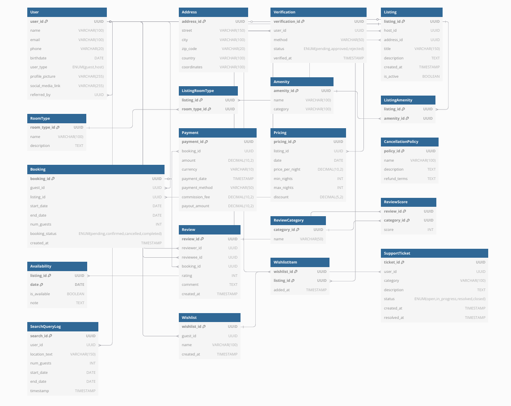
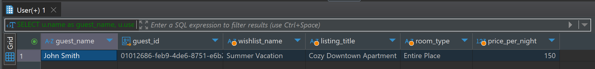

### Airbnb Database System

This project was built to fulfill a use case to provide a database system for Airbnb, add some data to it, and then be able to interact with the data based on different business cases. The system uses **PostgreSQL**.

### The ER Diagram



### Setting up the environment

#### Creating the database

Run the `/create_db.sql` file first. Then connect to the database in your database management system application or with the CLI.

This will also create the `airbnb` schema, which will then be used to accomodate all the tables, and data.

#### Create the tables

Run the `/create_tables.sql` to create the tables. These will then be added to the `airbnb` schema. 

#### Insert the data

Run the `/add_data.sql` file to insert data to all the tables. 

### Interacting with the database/use cases

#### Getting all listings

```sql
SELECT FROM "Listing";
```

#### Getting a specific listing

Get a specific listing, and data about the guest name, wishlist, and room type.

```sql
SELECT 
    u.name as guest_name,
    u.user_id as guest_id,
    w.name as wishlist_name,
    l.title as listing_title,
    rt.name as room_type,
    p.price_per_night
FROM "User" u
JOIN "Wishlist" w ON u.user_id = w.guest_id
JOIN "WishlistItem" wi ON w.wishlist_id = wi.wishlist_id
JOIN "Listing" l ON wi.listing_id = l.listing_id
JOIN "ListingRoomType" lrt ON l.listing_id = lrt.listing_id
JOIN "RoomType" rt ON lrt.room_type_id = rt.room_type_id
JOIN "Pricing" p ON l.listing_id = p.listing_id
WHERE u.user_type = 'guest'
LIMIT 1;
```

Result set:



#### Getting all bookings

```sql
SELECT FROM "Booking";
```

#### Getting all reviews

```sql
SELECT FROM "Review";
```

#### Getting all customer support tickets

```sql
SELECT FROM "SupportTicket";
```
### Notes

Using `OFFSET` when inserting data to tables with relations to other tables was necessary due to the fact that UUIDs are being used in the `INSERT` statements, so it would not be possible to guess the UUID values, as that is also going against the principle of UUIDs not being predicatble.
